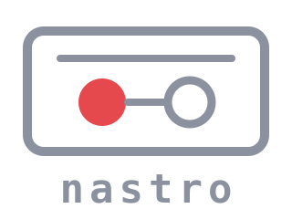

<div align="center">



**Record your calls from the terminal. No bots, no cloud.**

System audio + mic capture, local files, on-device diarized transcription.


</div>

---

Every call recorder wants to join your meeting as a bot, or ship your audio to someone's cloud. nastro does neither: it taps macOS system audio directly (CoreAudio process tap), writes a local file, and transcribes it on your machine with speaker labels — only when you ask.

```
nastro                      # TUI: browse, record, transcribe
nastro record               # headless recording, Ctrl+C = save
nastro records --plain      # scriptable list (tab-separated)
nastro transcribe last      # diarized transcript, on-device
```

## Why nastro

- **No bot in the call.** Capture happens at the OS level. Nothing joins your meeting, nothing is visible to other participants.
- **No cloud.** Audio and transcripts never leave your machine. Transcription runs locally (WhisperX or whisper.cpp).
- **Who said what.** Transcripts come out diarized: `[SPEAKER_00]`, `[SPEAKER_01]` — grouped by speaking turn, with SRT timestamps.
- **Never lose a call.** Audio is written incrementally: the file is valid even after a crash or `kill -9`. Transcripts are written atomically: an interrupted run never destroys an existing one. Deletes go to the Trash.
- **Terminal-native.** A fast single-binary TUI that inherits your terminal theme, with a headless CLI twin for scripting. Paths are OSC 8 hyperlinks — cmd+click opens Finder.

## Quickstart

```sh
brew install scaccogatto/tap/nastro
nastro
```

Or from source:

```sh
git clone https://github.com/scaccogatto/nastro
cd nastro && make build
./bin/nastro
```

Press `r`, name the recording (or just hit enter), and talk. `s` stops and saves. `t` transcribes.

On first recording, macOS will ask for **Screen & System Audio Recording** permission — the grant goes to your terminal app.

## Transcription

nastro is plug-and-play about its dependencies: it finds `whisperx`/`whisper-cli` even outside your `PATH`, and offers to install what's missing (via `uv`/`brew`, always with explicit confirmation).

The default backend is **WhisperX** (diarized, speaker-labeled output). It needs one manual step nastro can't do for you: a HuggingFace token with the [pyannote model terms](https://huggingface.co/pyannote/speaker-diarization-community-1) accepted — it's an access grant, not a download. Put it in your config as `hf_token` (or `$HF_TOKEN`). If anything is missing, the TUI walks you through it.

Prefer plain speed over speakers? Set `transcriber = "whisper-cli"` for whisper.cpp on Metal.

## Keys

| Key | Action |
|---|---|
| `r` | record (name + capture mode via `tab`) |
| `s` / `q` / `ctrl+c` | stop & save (while recording) |
| `x` | discard recording (with confirmation) |
| `enter` | detail view with transcript preview |
| `t` | transcribe (diarized) |
| `o` | reveal in Finder |
| `d` | delete → Trash |
| `/` | filter |
| `?` | help |

## Configuration

`~/.config/nastro/config.toml` — everything has a sane default:

```toml
output_dir = "~/Recordings/nastro"
transcriber = "whisperx"        # or "whisper-cli"
whisper_model = "large-v3-turbo"
lang = "it"                     # transcription language
hf_token = ""                   # HuggingFace token for diarization
```

## How it works

Two binaries, one job each:

- **`nastro`** (Go, Bubble Tea) — the TUI/CLI, orchestration, transcription pipeline
- **`nastro-tap`** (Swift) — audio capture via CoreAudio process tap + mic, incremental AAC writing, a red ● in the menu bar while recording

The filesystem is the source of truth: one directory per recording (`audio.m4a`, `metadata.json`, `transcript.txt/.srt`), no database. Everything the TUI does, the CLI does headless.

## Requirements

- macOS 14.4+ (CoreAudio process tap API)
- Go + Swift toolchain to build from source

## Roadmap

Separate mic/system tracks, optional video capture, markdown export. Design docs live in [docs/](docs/).

## License

[MIT](LICENSE)
